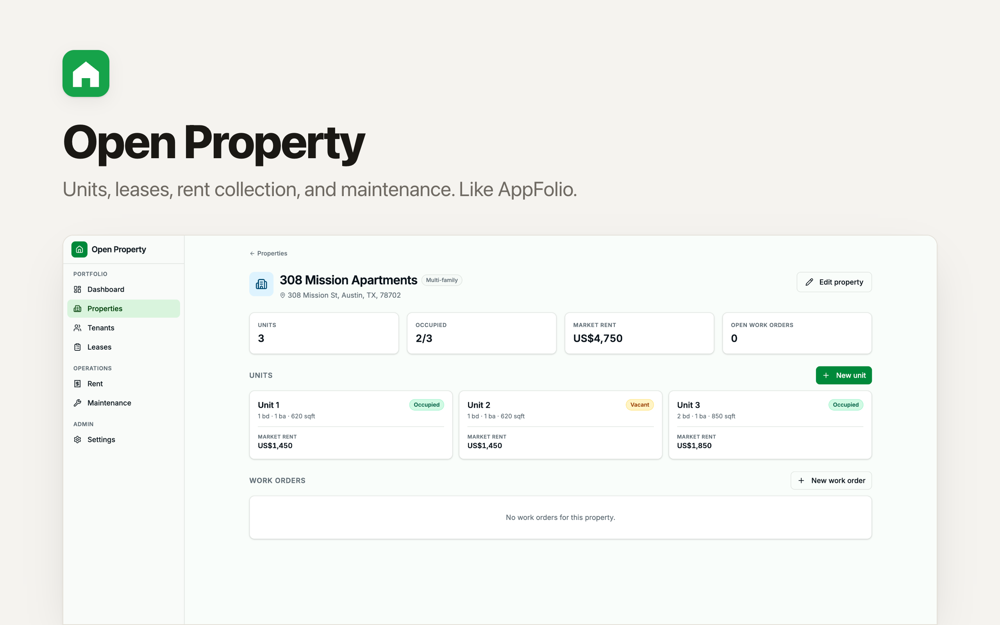

# Open Property

Open-source **property management software** — a self-hosted, cloud-based alternative to TenantCloud, AppFolio, Buildium, and Propertyware for landlords, small property managers, and apartment / multi-family back-office teams.

Rental property management with everything you need to run a portfolio: properties and units, tenants and leases, rent collection and a ledger, maintenance work orders, and a vendor directory.

> Built on the [Clawnify](https://clawnify.com) template format. Deploy your own copy in minutes, customize freely, own the data.

## Features

### Dashboard
- **At-a-glance KPIs** — occupancy rate, active leases, outstanding rent, open work orders
- **This month's rent** — collected, outstanding, overdue at a glance
- **Open work orders** + **upcoming lease expirations** — what to act on this week

### Properties & units
- Property cards with type, address, color tag, occupancy snapshot
- Per-property page with summary tiles, unit grid, and the property's open work orders
- Units track bedrooms, bathrooms, square footage, market rent, and status (vacant / occupied / turnover / unavailable)

### Tenants
- Searchable list showing each tenant's active unit and contact info
- Detail page with active lease, contact, employer, income, emergency contact, lease history

### Leases
- One row per lease with tenant, property · unit, term, monthly rent, and status
- Filters for active / upcoming / ended / all
- Edit-in-dialog with start / end / rent / deposit / due day / late fee / status

### Rent ledger
- One charge per active lease per month, generated idempotently with one click
- Period navigator (◀ / today / ▶) and totals: charged, collected, outstanding, overdue
- Record payments by amount, method, date, and reference. Status auto-updates as payments roll in
- Past payments visible per charge with one-click removal

### Maintenance
- Work orders with title, description, priority (urgent / high / normal / low), and status (open / assigned / in progress / completed / cancelled)
- Tabs: open / unassigned / assigned / in progress / completed / all
- Link work orders to a property, unit, and vendor; track scheduled date and cost

### Vendors & policy
- Vendor directory by category (plumber / electrician / HVAC / handyman / cleaning / landscaping / general)
- Rent policy defaults: due day, late fee, grace days, currency

## Stack

- React 19 + Vite + TypeScript
- Tailwind CSS v4 + shadcn/ui (Radix primitives)
- Hono on Cloudflare Workers (D1-native — same code locally and in production)
- `lucide-react` for icons
- pushState URL routing

## Develop

```bash
pnpm install
pnpm dev          # Vite at :5173, Wrangler at :8787 (D1 schema applied automatically)
pnpm typecheck
pnpm build
```

The dev script applies `src/server/schema.sql` to the local D1 database, then runs Vite and Wrangler in parallel. The schema seeds 3 sample properties, 5 units, and 3 vendors so the app is usable on first boot.

## Deploy

If you have the Clawnify CLI installed:

```bash
clawnify deploy
```

Or wire it up to Cloudflare Workers + D1 directly using the bindings in `wrangler.toml` (binding `DB`, database name `open-property-db`).

## Project layout

```
src/
  server/
    index.ts        Hono routes for every entity
    db.ts           D1 adapter (query / get / run)
    schema.sql      Tables + seed data
  client/
    app.tsx         Shell + routing
    components/
      dashboard/    Portfolio + month-at-a-glance
      properties/   List, property detail, property + unit dialogs
      tenants/      List, tenant detail, tenant dialog
      leases/       Leases page + lease dialog
      rent/         Rent ledger + payment dialog
      maintenance/  Work orders board + work-order dialog
      settings/     Vendors + rent policy defaults
      ui/           Vendored shadcn primitives
    hooks/          use-router, use-app-state
    lib/utils.ts    cn helper, color palette, date / money / period helpers
```

## What's intentionally not included

To keep this template self-hostable with no third-party SaaS dependencies and no public-facing endpoints, these features are out of scope:

- Listing syndication to external rental sites
- Real credit / background screening (placeholder application records only)
- 2-way SMS, email blasts, automated texting
- Online card / ACH payment processing
- Public tenant or owner portals

These can all be layered on top once you fork the template.

## License

MIT
